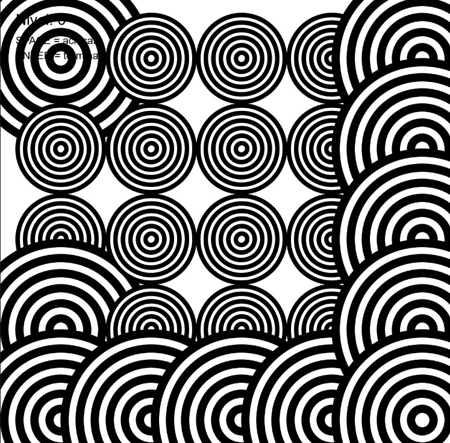
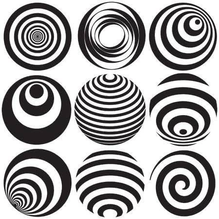
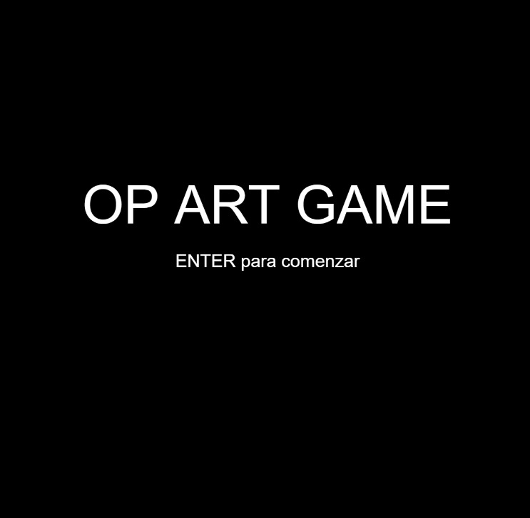
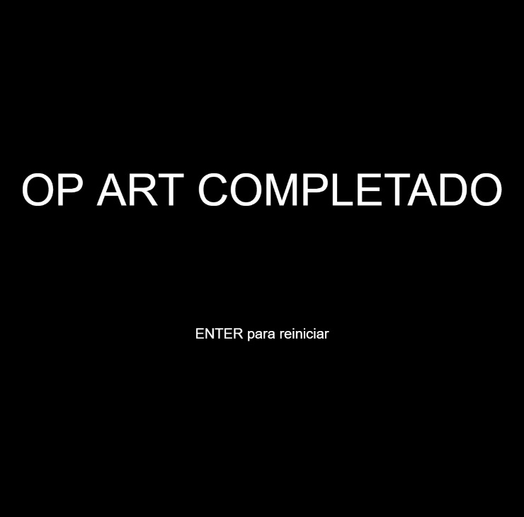
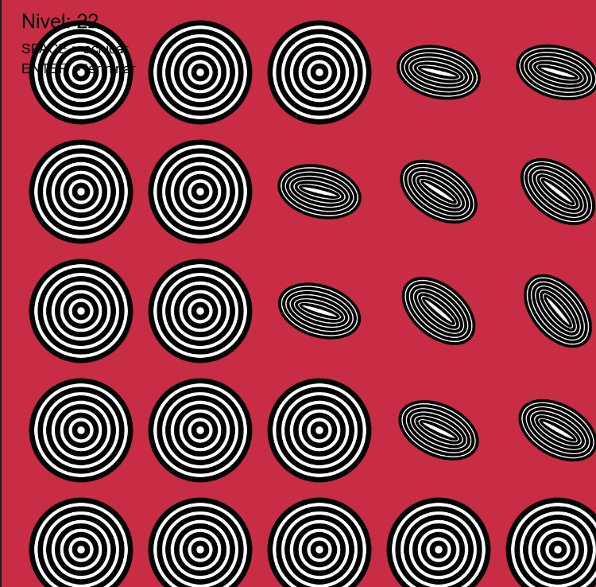
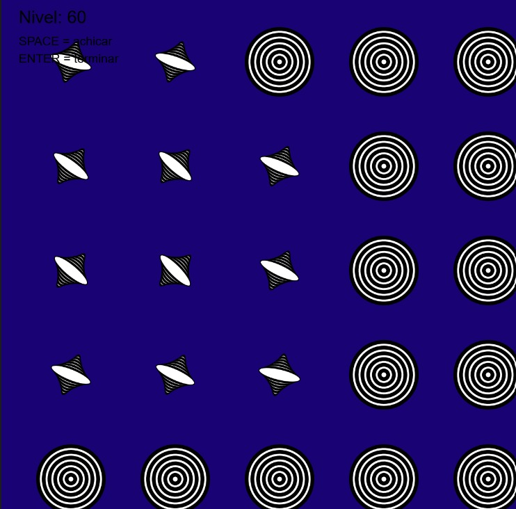
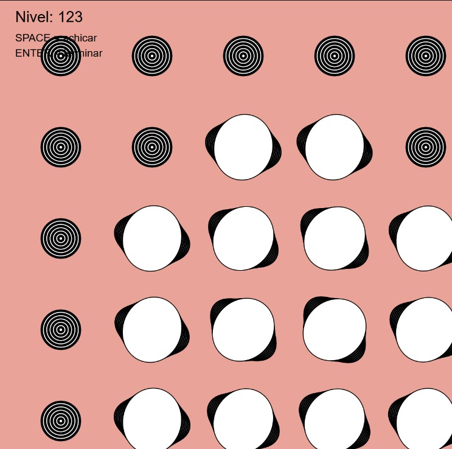
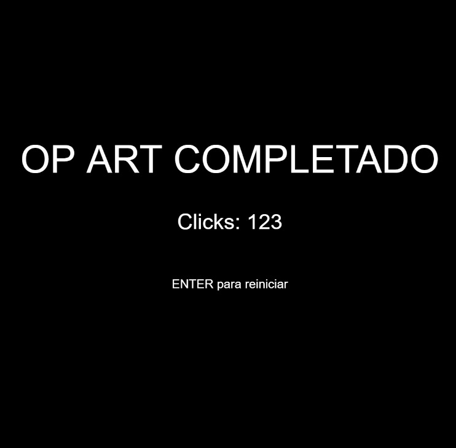
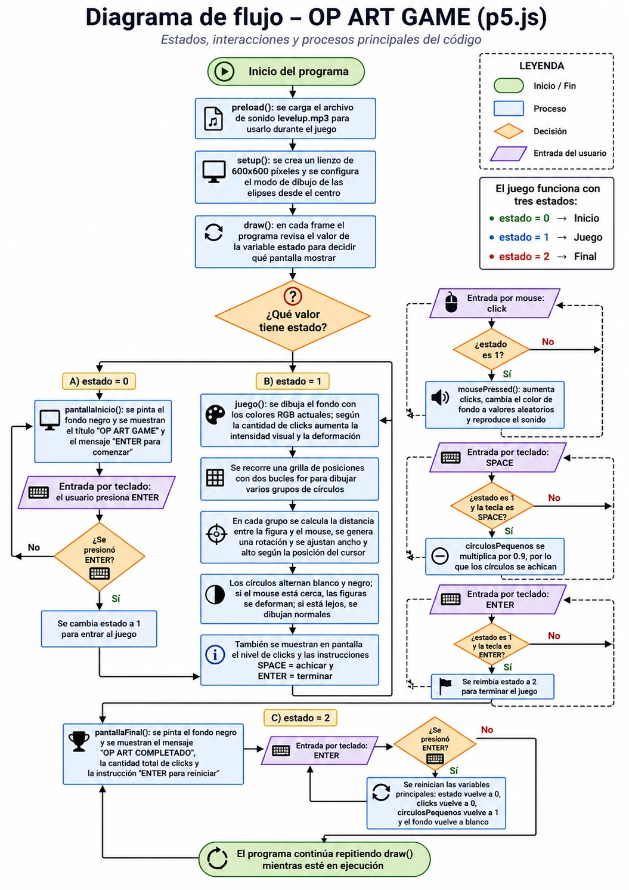

# Examen--Pensamiento-computacional-secc3
Sobre el proceso de mi examen a partir de mi solemne dos, que quería, lo que logre asimismo los errores y los códigos correctos.

**Autor:** Angela Sepúlveda.

## Descripción 
El proyecto consiste en una experiencia visual basada en el arte óptico, donde una cuadrícula de figuras concéntricas reacciona dinámicamente a la posición y acciones del usuario.

El sistema guía al usuario a través de una narrativa interactiva clásica de tres fases: una pantalla de bienvenida que anuncia el inicio de la experiencia, un lienzo central interactivo (el "juego") donde el movimiento y la interacción generan ilusiones ópticas de deformación y volumen, y una pantalla de cierre que recopila el desempeño del usuario (cantidad de interacciones/clicks realizados) a modo de victoria.

## Sistema del juego
Los códigos están programados de tal manera que al interactuar de una u otra forma el responda en tiempo real para generar respuestas audiovisuales dinámicas, en este código estan los estados;
- estado 0 (pantalla de inicio): el cual muestra el título "OP ART GAME" y las instrucciones correspondientes para empezar a jugar,
- estado 1 (juego): Al confirmarse el mensaje que da inicio al juego se despliega una cuadrícula interactiva.
- estado 2 (pantalla final): Muestra el mensaje de éxito "OP ART COMPLETADO" y despliega el contador final de clicks.
**Inputs**
  - Teclado (ENTER): Controla la transición lineal entre los estados (Inicio-Juego-Final-Reinicio).
  - Teclado (SPACE): Reduce progresivamente la escala base de los círculos en un 10% por pulsación.
  - Mouse (Movimiento mouseX / mouseY): Modifica los ángulos de rotación individuales de cada grupo geométrico y aplica una fuerza de deformación/estiramiento en los ejes X e Y.
  - Mouse (Click): Aumenta el nivel del juego, reproduce el sonido y cambia el color del fondo.

**Outputs**
- Cambio de color del fondo.
- Deformación y rotación de los círculos.
- Reproducción del sonido.
- Visualización del nivel (clicks).
- Pantalla final con el resultado obtenido.

Para que esto funcione hay una lógica interna;
Estructura de Cuadrícula: Mediante bucles for anidados se calcula una matriz de posiciones cartesianas fijas espaciadas cada 120 píxeles.

Efecto de Lupa Dinámica (Zoom): El sistema calcula constantemente la distancia (dist()) entre el cursor y el centro de cada grupo de círculos. Si el mouse entra en un radio de proximidad menor a 250 píxeles, el sistema aplica un condicional que altera el renderizado, aplicando una deformación matemática simulando un "zoom" o lente magnético.

Alternancia Óptica: Un bucle interno dibuja 12 círculos concéntricos. Utilizando el operador de módulo (i % 2 == 0), se evalúa si el índice de la figura es par o impar para alternar los colores de relleno (fill) entre blanco y negro.

Mapeo Proporcional: Se utiliza la función map() para traducir de forma fluida el rango de clicks realizados en incrementos de escala geométrica (intensidad) y deformación límite (deformacionNivel).    

## Referente e inspiración      
El proyecto toma como referente a **Bridget Riley** (referente la cual también usé en la solemne pasada), una de las principales representantes del **Op Art**, movimiento artístico que utiliza patrones geométricos repetitivos, contrastes de blanco y negro e ilusiones ópticas para generar la sensación de movimiento en una superficie estática. En mi solemne 2 ya había trabajado estos principios mediante círculos concéntricos, rotaciones y deformaciones, por lo que para este examen quise mantener esa base visual y transformarla en una experiencia interactiva.
     

A diferencia de la propuesta anterior, donde el usuario solo podía mover los círculos y modificar su tamaño hasta cierto punto, en este proyecto pasa a intervenir directamente en la obra. Mediante el movimiento del mouse, los clicks y la barra espaciadora puede modificar la rotación, el tamaño y la deformación de los círculos, haciendo que las ilusiones ópticas cambien constantemente según su interacción, generando una composición visual distinta en cada experiencia. De esta forma, el proyecto mantiene la exploración visual característica de Bridget Riley, pero la adapta a un formato digital donde cada usuario genera una composición distinta en tiempo real.

## Proceso
Inicié en base a mi solemne 2 en la cual era un sistema donde Aparecían elipses en blanco y negro, rotaciones dinámicas, variaciones de grosor en las líneas y deformaciones que cambian según la interacción del usuario 
   

por lo cual quise mantener este sistema pero convertirlo en un juego donde la pantalla inicial diera la partida de este (estado 0), que al estar dentro uno pudiese interactuar con el movimiento de los círculos tanto rotándolos como haciéndolos más grandes o pequeños (estado 1) y al colocar enter uno pueda ver cuantos clicks hiciste para deformar la figura.      
    

Para lograrlo, lo primero que hice fue implementar una estructura de máquina de estados utilizando una variable llamada estado. Con lo cual logré dividir el programa en los tres estados: pantallaInicio(), juego() (donde puse mi código de solemne 2 y adapté la lógica del primer código) y pantallaFinal(). Controlé la transición entre estas pantallas mediante el teclado en la función keyPressed(), usando la tecla ENTER para avanzar entre el inicio, el juego y el reinicio.         
            
          
(estado 2 aunque no se vea)       
       
Además de la estructura por estados, incorporé un archivo de audio (levelup.mp3) cargado en preload() para cuando el usuario interactué con el sistema este se haga presente.

Dentro de la función principal del juego(), mantuve el canva de 600x600 y la lógica de los ciclos for anidados que ya había desarrollado en el primer código. Sin embargo, para que se sintiera como un juego donde el usuario progresa, introduje una variable llamada clicks. Cada vez que el usuario hace clic con el mouse (mousePressed()), el nivel aumenta, se reproduce el sonido, el sonido corresponde a cuando mario crece al tocar un champiñon ya que el personaje crece del mismo modo que el efecto de mi sistema, solo lo hice así ya que era más fácil de asimilar, Aunque el sonido no pertenece al contexto del Op Art, decidí utilizarlo porque representa el crecimiento del personaje, una idea que se relaciona con el aumento progresivo de la deformación dentro del sistema.
[Escuchar efecto de sonido de hongo de Super Mario Bros.](https://youtu.be/6G-k4zxou7Y)

y el color de fondo cambia aleatoriamente mediante random(255), rompiendo con la monotonía del blanco y negro original.

La interactividad con los módulos también evolucionó para volverse con más distorsión a medida avanzas el juego, esto se logra con: 

Intensidad y Deformación Progresiva: Utilicé la función map() vinculada a la variable clicks para calcular una intensidad y una deformacionNivel. Así, mientras más clics hace el jugador, los círculos concéntricos crecen más y se deforman de manera mucho más agresiva con el movimiento del mouse (mouseX y mouseY) 

Mecánica de la barra espaciadora: Para darle al usuario un mayor control sobre la composición, incorporé la variable circulosPequenos. Cada vez que se presiona la barra espaciadora, esta variable se multiplica por 0.9, reduciendo progresivamente el tamaño de todos los círculos. Posteriormente, este valor se aplica al calcular el tamaño de cada figura mediante la expresión let tamano = baseTamano * circulosPequenos;, permitiendo que el usuario encoja el patrón en tiempo real y pueda apreciar con mayor claridad las deformaciones y los cambios de color que se producen a medida que aumenta el nivel.

La idea de que los círculos pudieran crecer y achicarse 

Finalmente, en la pantalla de juego incluí elementos de texto con text() para indicarle al usuario su nivel actual (los clics acumulados) y los comandos disponibles (SPACE y ENTER). El uso de push() y pop() siguió siendo fundamental para que toda esta nueva locura visual y geométrica se mantuviera contenida de forma independiente en cada coordenada de la grilla, logrando un juego visual dinámico que reacciona tanto al mouse como al progreso y teclado del jugador.

## Resultado 
A continuación, se presenta el resultado visual del 'OP ART GAME' en acción. En las capturas se evidencia cómo el fondo blanco inicial cambia a una paleta cromática aleatoria (RGB) con cada click, interactuando directamente con la deformación geométrica del patrón en tiempo real.
 
   
 
   
a medida que uno hace más clicks los círculos se deforman mucho más, para ilustrarlo y que se viese el color y la gran deformación fui haciendo click y a la misma vez achicándolo esto se logra con el codigo:
let deformacionNivel = map(clicks, 0, 20, 10, 80);
Con 0 clicks: deformación de 10 o sea, una pequeña deformación y a partir de 20 clicks es una deformación de 80 o sea una gran deformación

y con el codigo
if(estado == 1 && key === " "){
  circulosPequenos *= 0.9;
}

Este código sirve para achicar los círculos cuando el usuario presiona la barra espaciadora. Primero verifica que el programa esté en la pantalla del juego (estado == 1) y que la tecla presionada sea SPACE (key === " "). Si ambas condiciones se cumplen, la variable circulosPequenos se multiplica por 0.9. Como este valor es menor que 1, cada vez que se presiona SPACE los círculos reducen su tamaño en un 10%. Después, esa variable se utiliza al calcular el tamaño de cada círculo (let tamano = baseTamano * circulosPequenos), por lo que todos se dibujan cada vez más pequeños. 

## Conclusión
Durante el desarrollo del proyecto aprendí la importancia de organizar el programa mediante estados para controlar las diferentes pantallas del juego. Uno de los mayores desafíos fue equilibrar el crecimiento de los círculos con la función que los reducía usando la barra espaciadora, ya que inicialmente ambos comportamientos se anulaban entre sí. Después de varias pruebas logré ajustar la lógica para que ambas mecánicas convivieran correctamente. También comprendí mejor el uso de funciones como map(), dist(), random() y la importancia de separar el código en funciones para facilitar su lectura y mantenimiento. En comparación con mi solemne 2, siento que este proyecto evolucionó desde una visualización interactiva hacia una experiencia mucho más dinámica donde el usuario influye directamente en el resultado visual en vez de solo poder jugar con las figuras, pensé que tal vez no podría llegar a los resultados que quería, pero finalmente quedé muy conforme al ver que el proyecto terminó siendo exactamente la idea que tenía desde el principio.

## Diagrama de flujo 
A continuación, se presenta el diagrama de flujo del proyecto, el cual representa de forma simplificada la lógica de funcionamiento del programa. En él se muestran los principales procesos, decisiones e interacciones entre el usuario y el sistema, permitiendo visualizar cómo se desarrolla la experiencia desde la pantalla de inicio, pasando por el juego interactivo, hasta la pantalla final.
 

  
